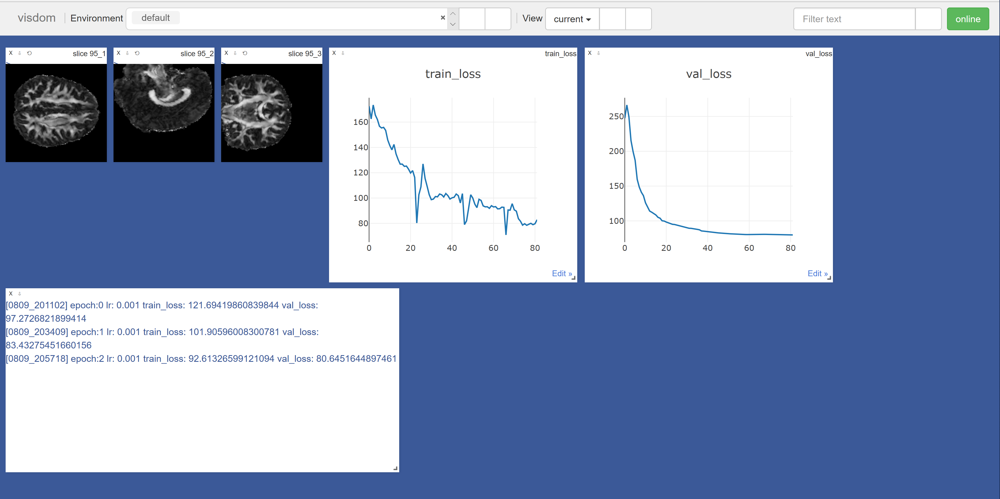

# 3d-CNN-DTI
## About

This project is for constructing a simple 3d-based deep learning model for brain imaging data. Some details would be changed across the time.

## Data

The sample data were processed DTI imaging data (FA and MD maps). For each child, both his FA and MD maps were loaded with the label as one subject of the dataset. The dataset created by the package `torchio` directly fits `torch.utils.data.DataLoader`. This project may need some data augmentation techniques, which can be achieved in the process of creating datasets. The default setting of transformation includes random randomflips random affine, random elastic deformation random noise, random motion and random bias field. Please refer to https://torchio.readthedocs.io/ for any infomation about transformation. (Pérez-García et al., TorchIO: a Python library for efficient loading, preprocessing, augmentation and patch-based sampling of medical images
in deep learning. Link: https://arxiv.org/abs/2003.04696). The data is currently imbalanced thus a RandomWeightedSampler has been used for loading training data.

## Usage

The model runs smoothly on sample data. However, for real data, the sample size should be large enough(with correct labels), the architecture of the model should be more valid and transformation parameters should be figured out carefully.

run the demo:

set up the visdom server first:
```
python -m visdom.server
```
start training and navigate to the dashboard(default) to check the progress:
```
python main.py train
```


