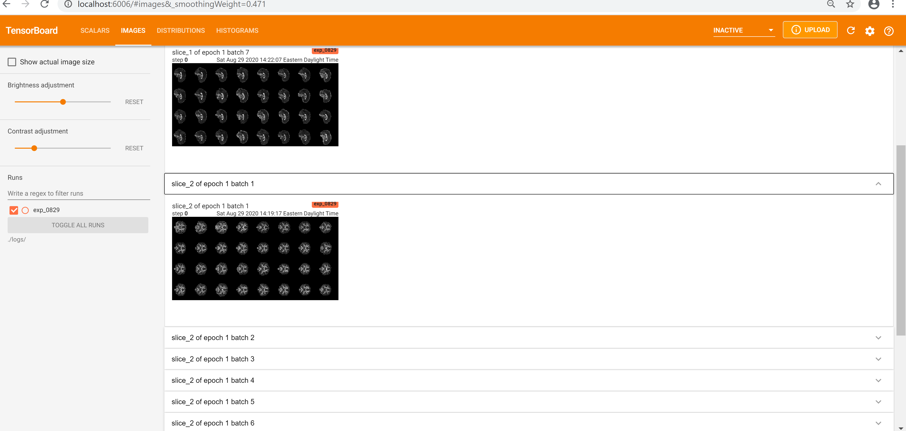
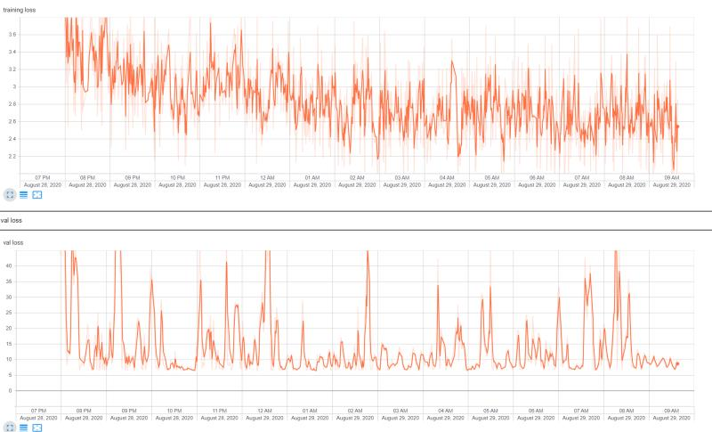

# InterpretableDL
## About

This project is for constructing a simple 3d-based convolutional neural network for brain imaging data. The trained model would be used for developing a highly interpretable deep leanring method for 3d brain imaging data. Currently, this repo only focuses on building a predictive neural network.

## Data

The data were processed DTI imaging data (FA ,MD and other maps) and were not shared online. The dataset created by the package `torchio` directly fits `torch.utils.data.DataLoader`. Currently we have 1599 available subjects for training. The default setting for data transformation is `None` . Please refer to https://torchio.readthedocs.io/ for any infomation about transformation. (Pérez-García et al., TorchIO: a Python library for efficient loading, preprocessing, augmentation and patch-based sampling of medical images
in deep learning. Link: https://arxiv.org/abs/2003.04696).

**Note: although we have a matched criterion for training set. We did not apply it in this version. A matched training set will be added soon.**

## Usage

### Requirement:

Python 3.7 +
Tensorflow 
Pytorch 
CUDA 10.1
CuDNN

### run:

start training:
```
python main.py train --load=False
```


set up the dashboard for visualization:
```
tensorboard --logdir=./logs/exp_mm-dd/ #mm-dd:month-day, e.g. 09-02

```




## Update
08/29/20
The model is still being training under different architectures.
