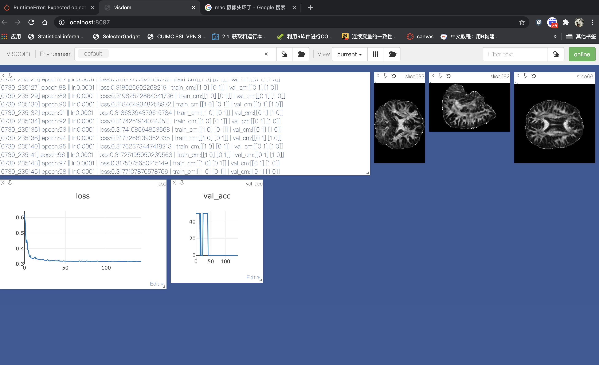

# 3d-CNN-DTI
## 2020.07.24
This project is for constructing a 3d-based deep learning model for brain imaging data. Some details would be changed across the time.
## 2020.07.25
set up dataloader  using torchio
Pérez-García et al., TorchIO: a Python library for efficient loading,
preprocessing, augmentation and patch-based sampling of medical images
in deep learning. Link: https://arxiv.org/abs/2003.04696
## 2020.07.26
added train funcs, not yet completed
## 2020.07.29
The model runs smoothly on sample data;

